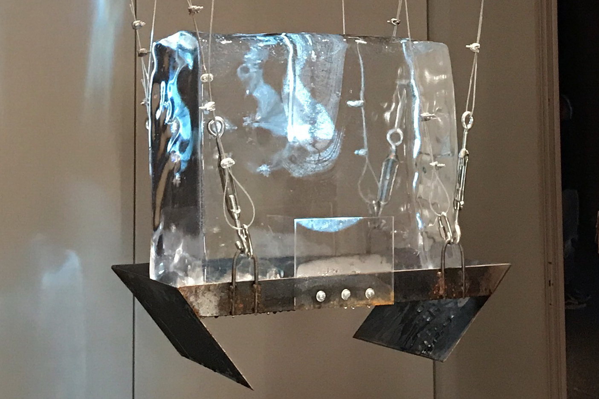
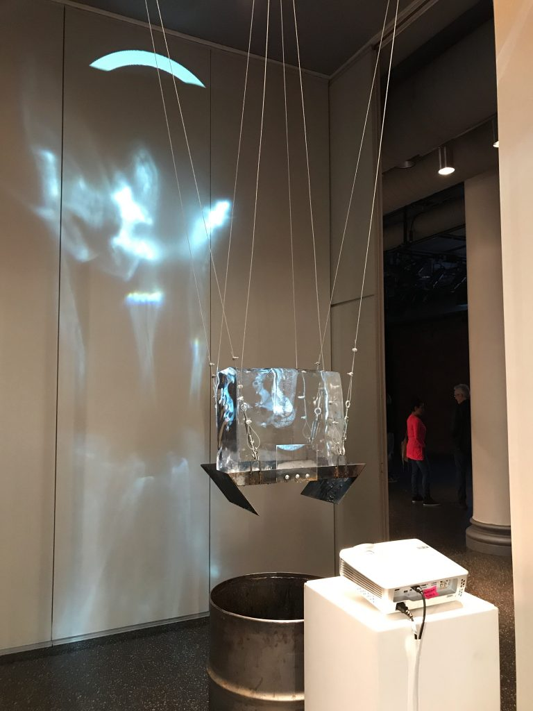

# Bail Bloc

Bail Bloc is a computer program that bails people out of jail. Volunteers can download the application to any desktop or laptop computer. The app runs in the background of everyday use, mining a cryptocurrency called Monero. The rewards from mining are exchanged for $USD and donated directly to the Bronx Freedom Fund, which uses 100% of the money to pay bail for low income, marginalized individuals.

Research has shown that being able to afford bail increases the likelihood of winning a case taken to trial by 40%. Bail not only allows people to be released from pre-trial detention, but also serves to increase the number of cases dismissed.

Bail Bloc was created along with my collaborators Maya Binyam, Francis Tseng, JB Rubinovitz, Sam Lavigne, and the Dark Inquiry collective.

[Visit the official project site here](//bailbloc.thenewinquiry.com)

## This is another test

<iframe width="853" height="480" src="https://www.youtube.com/embed/DAWyEkIxacg" frameborder="0" allowfullscreen></iframe>

## Press
www.google.com/123
